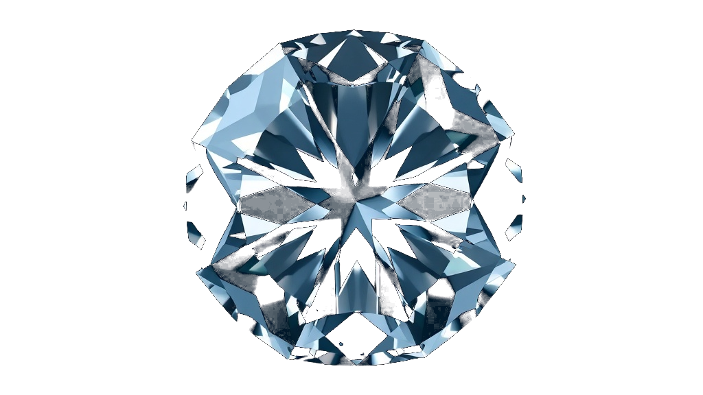
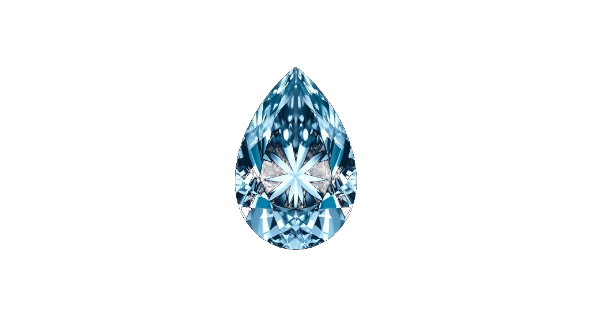

<!-- ───────────────────────────  HERO  ─────────────────────────── -->
<p align="center">
  <a href="https://jdwhite.world">
    
  </a>
</p>

<p align="center">
  
</p>

<h1 align="center">jdwhite.world — The JD White Portal</h1>

<p align="center">
  <em>The cinematic entry point into the JD White ecosystem.<br>
  A discovery-driven system portal — not a marketing site.</em>
</p>

<!-- ──────────────────────────  BADGES  ────────────────────────── -->
<p align="center">
  <a href="https://jdwhite.world"></a>
  <a href="https://basescan.org/address/0x1d442F1CfCe1C08193d529aC07Db72E02C30DfB3"></a>
  <a href="https://talent.app"></a>
  
</p>

<!-- ─────────────────  SIGNATURE: DIAMOND PORTALS  ───────────────── -->
<p align="center">
  
  
  
  
  
</p>

<p align="center"><sub>The diamond portals — the signature of the system. Each one is a routing node into a different part of the ecosystem.</sub></p>

---

> **Note on motion:** the cinematic galaxy, parallax depth, custom cursor, and the diamond portals' descent/drift animations are all *live* — experience them at **[jdwhite.world](https://jdwhite.world)**. GitHub READMEs are static, so this page shows the brand; the portal shows it breathing.

This repository is the source for the live [jdwhite.world](https://jdwhite.world) experience and the public project record for [talent.app](https://talent.app).

---

## Who is building this

**JD White** — founder, systems architect, and creative director of **JD Productions**.

I build systems that compound: software, creative infrastructure, and an onchain participation economy on **Base**. The work spans a cinematic web portal, an AI operating system, payment infrastructure, and open-source developer tooling. The through-line is simple — *build what comes next, and make it usable.*

This is not a portfolio of talk. It is a set of shipped, verifiable systems.

---

## What this is

A layered, immersive web portal — custom canvas atmosphere, animated diamond "portals," and a void-dominant cinematic design system, hand-built in HTML/CSS/JS with zero template scaffolding. Each portal is a routing node into a distinct part of the ecosystem.

| Layer | Description |
|---|---|
| **The Portal** | `index.html` — the cinematic gateway at jdwhite.world |
| **JD Productions** | `/productions` — the creative + production studio |
| **The System** | `/system` — the operating infrastructure behind the work |
| **Work With Me** | `/work-with-me` — direct partnership pathway |
| **Founder** | `/founder` — the builder behind the system |

Built for speed and depth at once: lazy-loaded assets, hardware-accelerated motion, semantic markup, and a forward path to a PWA / route-based app shell.

---

## The ecosystem

| Project | What it is | Link |
|---|---|---|
| **JD White Portal** | This site — cinematic ecosystem gateway | [jdwhite.world](https://jdwhite.world) |
| **JD Productions** | Creative studio + production company | [jdproductions.io](https://jdproductions.io) |
| **Bridge Video** | Video production venture | [bridgevideo.co](https://bridgevideo.co) |
| **The Collection** | A living digital gallery | [thecollection.world](https://thecollection.world) |
| **JDP** | Participation asset of the JD ecosystem on Base | [jdptoken.com](https://jdptoken.com) |

### Onchain (Base)

- **JDP** — an ERC-20 **participation asset** of the JD ecosystem on Base (designed to *hold, use, and participate* — not a reward, payment, or speculative instrument).
- **Verified contract:** [`0x1d442F1CfCe1C08193d529aC07Db72E02C30DfB3`](https://basescan.org/address/0x1d442F1CfCe1C08193d529aC07Db72E02C30DfB3)

---

## Open-source builds

Public, auditable work by JD White ([github.com/jdwhite0](https://github.com/jdwhite0)):

- **[jd-ai-system-optimizer](https://github.com/jdwhite0/jd-ai-system-optimizer)** — free toolkit to cut AI cost without cutting quality (multi-model routing, cost guard, live statusline).
- **[jd-ai-operating-system](https://github.com/jdwhite0/jd-ai-operating-system)** — a structured second brain any AI can plug into and operate from.
- **[jdp-token-contract](https://github.com/jdwhite0/jdp-token-contract)** — the verified, open-source JDP ERC-20 contract on Base.

---

## Tech

Static, fast, dependency-light. HTML5 · CSS3 (custom design system, layered gradients) · vanilla JavaScript · Canvas animation · Vercel edge deployment · one serverless function (`api/subscribe.js`, env-based, no embedded keys).

```
.
├── index.html          # cinematic portal (homepage)
├── productions/        # JD Productions studio
├── system/             # The System
├── work-with-me/       # partnership pathway
├── founder/            # the builder
├── assets/             # images + media
├── api/subscribe.js    # serverless subscribe (env-keyed)
├── robots.txt · sitemap.xml · vercel.json
```

---

## talent.app

This repository is the public project record for **JD White** on [talent.app](https://talent.app), supporting verified builder activity in the **Base** ecosystem. Domain ownership of `jdwhite.world` is verified via a `talentapp:project_verification` meta tag in the homepage `<head>`.

---

## License

MIT © JD White / JD Productions. See [LICENSE](LICENSE).

> Source code is open. The brand, name "JD White / JD Productions," logos, portrait, and generated visual assets in `/assets` remain the property of JD White and are not licensed for reuse.
